# Forensiq Demo - Cognitive UI

*This documentation is licensed under [Creative Commons Attribution-ShareAlike 4.0 International](https://creativecommons.org/licenses/by-sa/4.0/) (CC BY-SA 4.0).*

This is the Forensiq demo referenced in the Thalamus whitepaper. It demonstrates a textual TUI (Terminal User Interface) representing cognitive AI layers.

## Screen captures

Recorded demos live in **`captures/`** in this folder (also mirrored on [GitHub Releases](https://github.com/sanctumos/thalamus/releases)).

### Default scenario (`--scenario forensiq`)

**Video:** [captures/forensiq/forensiq-demo.mp4](captures/forensiq/forensiq-demo.mp4) (~90s · 240×56 terminal)

| Frame | Caption |
|-------|---------|
| 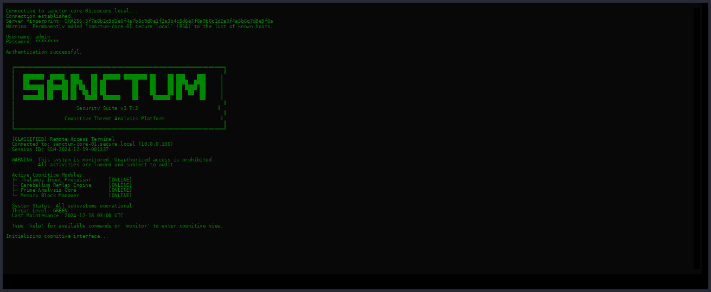 | SSH login + MOTD |
| 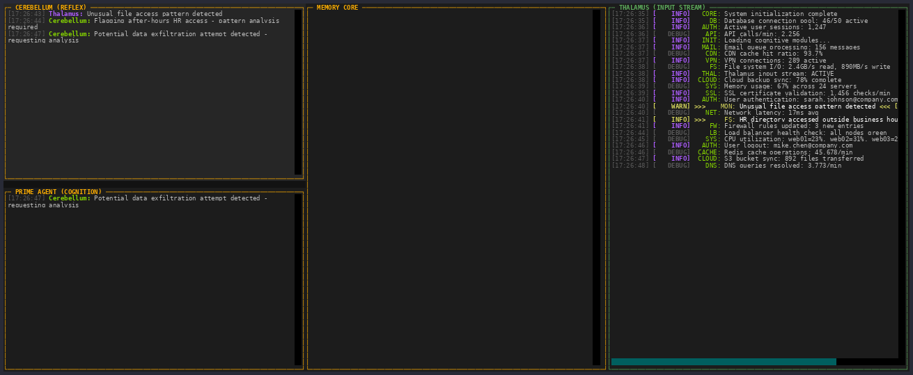 | First HR incident / four-pane layout |
| 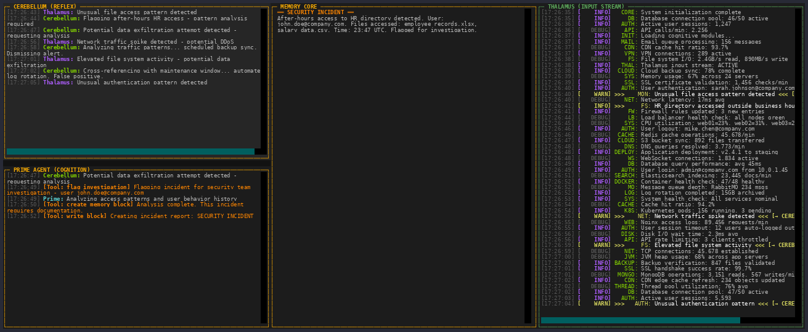 | Brute force + SECURITY INCIDENT memory |
| 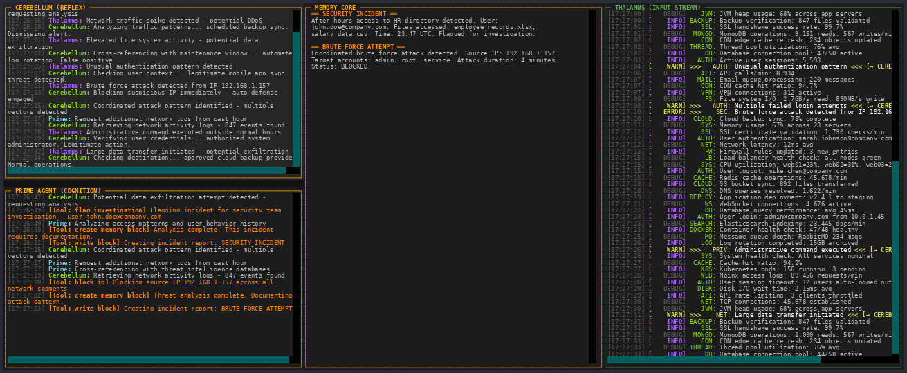 | Prime escalation + tool actions |
| 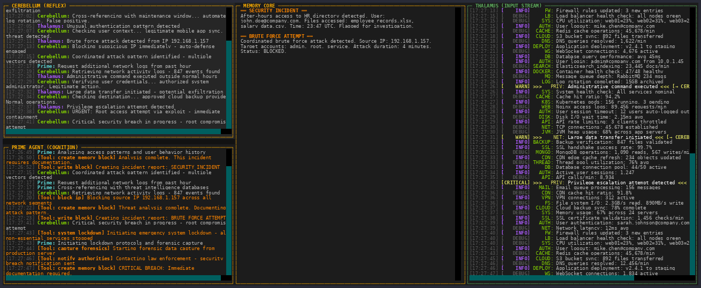 | CRITICAL ALERT memory block |

Release tag: [`forensiq-demo-1.0`](https://github.com/sanctumos/thalamus/releases/tag/forensiq-demo-1.0)

### MITM scenario (`--scenario mitm`)

**Video:** [captures/mitm/forensiq-mitm-latest.mp4](captures/mitm/forensiq-mitm-latest.mp4) (~95s · hospital token-abuse narrative)

| Frame | Caption |
|-------|---------|
|  | Denver sign-in, token reuse warning |
| 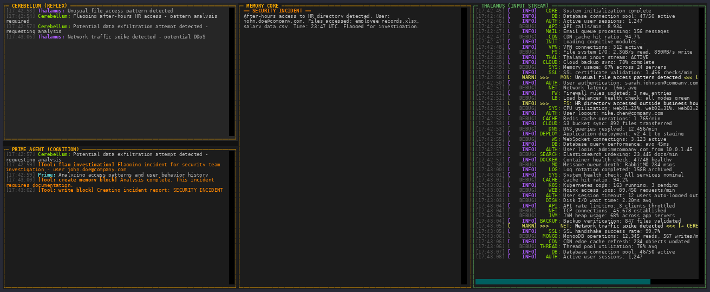 | TOKEN ABUSE INDICATOR memory block |
| 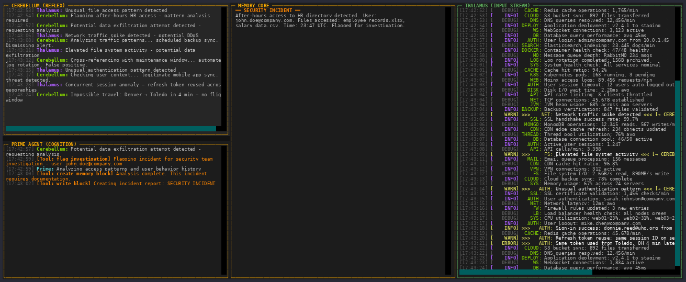 | Privileged-Ops + Global Admin signals |
| 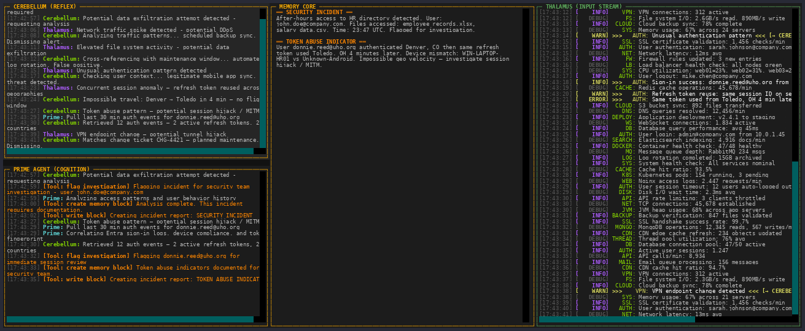 | **CRITICAL ALERT: POTENTIAL MAN-IN-THE-MIDDLE** |

Release tag: [`forensiq-demo-mitm-1.0`](https://github.com/sanctumos/thalamus/releases/tag/forensiq-demo-mitm-1.0)

### Graph fixture scenarios (`--scenario graph-fixtures`)

**Videos:**
- [captures/graph-fixtures/graph-fixtures-wide.mp4](captures/graph-fixtures/graph-fixtures-wide.mp4) (240x56)
- [captures/graph-fixtures/graph-fixtures-narrow.mp4](captures/graph-fixtures/graph-fixtures-narrow.mp4) (100x30)

| Frame | Caption |
|-------|---------|
| 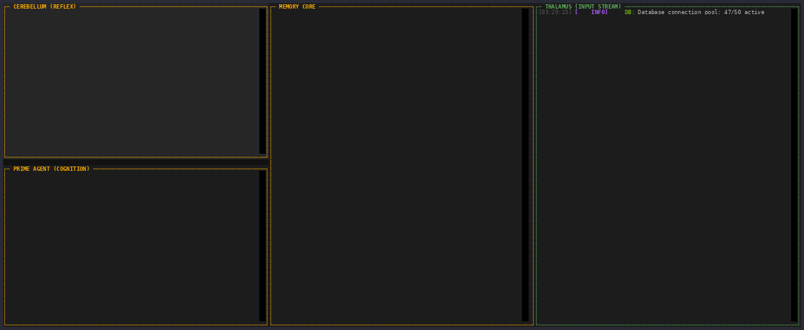 | Startup/four-pane layout with fixture mode active |
| 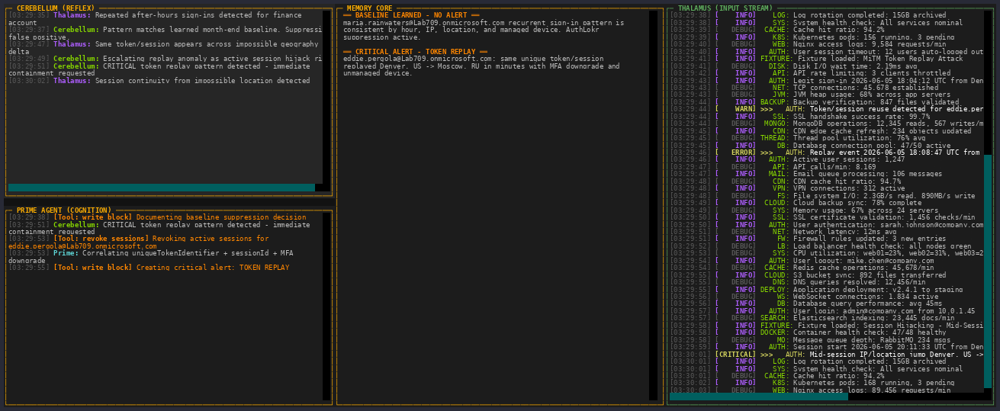 | Baseline suppression + token replay + session hijack alerts |
| 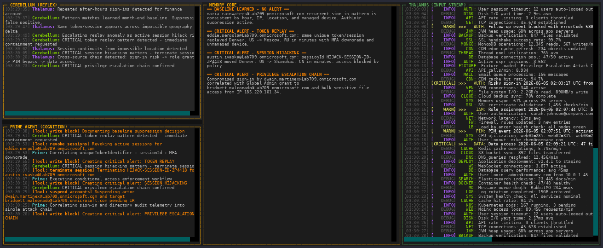 | Privilege escalation chain visible in chat/memory panes |
| 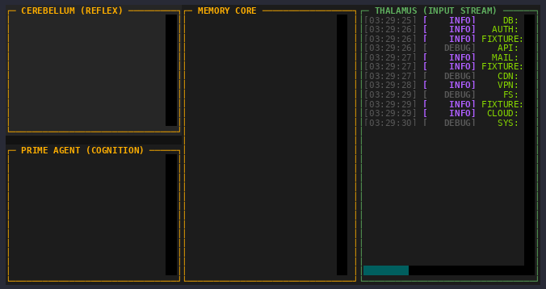 | Narrow viewport rendering check |
| 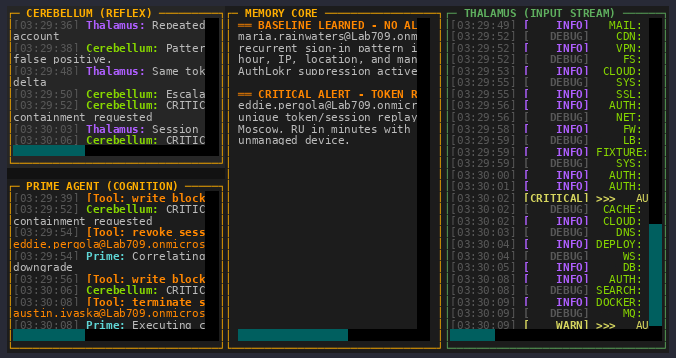 | Narrow viewport with active alerts and wrapped memory text |

## Overview

The Forensiq demo showcases the cognitive architecture described in the Thalamus whitepaper through an interactive terminal interface. It simulates the flow of information through different cognitive layers including:

- **Cochlea**: Raw sensory input processing
- **Thalamus**: Parallel refinement and flow control
- **Cerebellum**: Reflex processing and quick responses
- **Prime Agent**: Higher-order synthesis and decision-making

## Features

- Real-time cognitive layer visualization
- Interactive terminal interface
- Simulated data flow through cognitive architecture
- Demonstration of reflex vs. depth processing

## Requirements

```bash
pip install textual rich
```

## Usage

```bash
python main.py
```

### Scenarios

| Flag | Narrative |
|------|-----------|
| `--scenario forensiq` (default) | HR incident, brute force, active breach |
| `--scenario mitm` | Hospital token-abuse / MITM (Denver→Toledo reuse, privileged takeover, **CRITICAL ALERT: POTENTIAL MAN-IN-THE-MIDDLE**) |
| `--scenario graph-fixtures` | Run all 4 Graph fixture narratives from `examples/authlokr_graph_fixtures/` |
| `--scenario graph-baseline` | Fixture 01 baseline learning (NO alert) |
| `--scenario graph-token-replay` | Fixture 02 token replay (CRITICAL) |
| `--scenario graph-session-hijack` | Fixture 03 session hijacking (CRITICAL + block) |
| `--scenario graph-privilege-chain` | Fixture 04 privilege escalation chain (CRITICAL) |

```bash
python main.py --auto-close --scenario mitm
```

```bash
python main.py --auto-close --scenario graph-fixtures --auto-close-seconds 140
```

For screen capture, use a wide terminal (`COLUMNS=240 LINES=56`) and extend the auto-close timer if needed with `--auto-close-seconds`.

## Architecture

The demo implements the cognitive architecture described in the Thalamus whitepaper:

1. **Raw Input Processing**: Simulates Cochlea receiving sensory data
2. **Parallel Refinement**: Shows Thalamus processing raw input while preparing refined versions
3. **Reflex Processing**: Demonstrates Cerebellum's quick response capabilities
4. **Deep Cognition**: Shows Prime Agent's higher-order processing

## Demo Modes

- **Interactive Mode**: User can interact with the interface
- **Test Mode**: Automated demonstration of the system
- **Auto-close Mode**: Runs demo and exits automatically

## Related Documentation

- [Thalamus Whitepaper](../../thalamus_whitepaper_draft%20(1).md) - Main technical documentation
- [Demo Guide](../DEMO_GUIDE.md) - General demo instructions
- [API Reference](../API_REFERENCE.md) - Technical API documentation
